# 🔷 Algorand Task Tokenization Architecture

## Overview

KortexFlow uses a **thin on-chain, rich off-chain** architecture to tokenize tasks from emails and calendar events while maintaining privacy and scalability.

---

## 🏗️ Architecture Components

### 1. **Identity Binding (Login)**

**Method**: WalletConnect + Pera Wallet (TestNet)

```typescript
// Sign-in with Algorand flow
async function signInWithAlgorand(walletAddress: string) {
  // 1. Generate nonce
  const nonce = crypto.randomBytes(32).toString('hex');
  
  // 2. User signs nonce with wallet
  const signature = await peraWallet.signData([{
    data: Buffer.from(nonce),
    message: "Sign in to KortexFlow"
  }]);
  
  // 3. Verify signature server-side
  const isValid = algosdk.verifyBytes(
    Buffer.from(nonce),
    signature,
    walletAddress
  );
  
  // 4. Create mapping: email_hash -> algorand_address
  const emailHash = sha256(email.toLowerCase() + TENANT_SALT);
  await db.storeMapping(emailHash, walletAddress);
}
```

**Privacy Guarantee**:
- Raw emails NEVER stored on-chain
- Only `email_hash = SHA256(lowercase(email) + per-tenant-salt)`
- Off-chain mapping: `email_hash -> algorand_address`

---

### 2. **Token Model (ARC-3 Compliant)**

Each task = **1-unit ASA** (Algorand Standard Asset)

**Metadata Structure** (IPFS):
```json
{
  "name": "TASK: Draft proposal",
  "description": "From email <subject> / calendar <eventId>",
  "image": "ipfs://task-icon-cid",
  "properties": {
    "source": "email|calendar",
    "external_id": "gmailMessageId|msGraphEventId",
    "assignee_hash": "sha256_email_hash",
    "creator_hash": "sha256_email_hash",
    "status": "open|in_progress|done",
    "due": "2025-11-15T18:30:00Z",
    "priority": "H|M|L",
    "labels": ["sales", "q4"],
    "created_at": "2025-11-10T12:00:00Z"
  }
}
```

**ASA Configuration**:
- `unit-name`: "TFLOW"
- `asset-name`: "Kortex Task"
- `total`: 1 (fungible supply)
- `decimals`: 0
- `url`: `ipfs://bafy...` (metadata CID)
- `metadata-hash`: SHA256 of metadata JSON (ARC-3)

---

### 3. **Smart Contract (PyTeal)**

**App Methods**:

```python
# create_task(cid: str, assignee_hash: str) -> task_id
# claim(task_id: int) -> bool
# update_status(task_id: int, status: str) -> bool
# reassign(task_id: int, new_assignee_hash: str) -> bool
```

**Box Storage** (keyed by `task_id`):
```python
{
  "assignee_hash": bytes,
  "creator_hash": bytes,
  "status": bytes,  # open|in_progress|done
  "cid": bytes,     # IPFS CID
  "created_at": int,
  "updated_at": int
}
```

**Guards**:
- ✅ `reassign`: Only creator OR current assignee
- ✅ `complete`: Only current assignee
- ✅ `claim`: Only if status == "open"
- ✅ Atomic group required: [App call + ASA transfer]

---

## 📊 Data Flow

### **Task Creation Flow**

```mermaid
graph LR
    A[Email/Calendar Event] --> B[Webhook]
    B --> C[Parse & Extract]
    C --> D[Generate Metadata]
    D --> E[Upload to IPFS]
    E --> F[Get CID]
    F --> G[Create ASA]
    G --> H[App Call: create_task]
    H --> I[Transfer to Assignee]
    I --> J[Index Task]
    J --> K[UI Update]
```



### **Step-by-Step**:

1. **Gmail/Calendar Webhook** → New task detected
2. **Parse** → Extract: title, assignee email, due date, priority
3. **Hash Email** → `assignee_hash = SHA256(email + salt)`
4. **Resolve Address** → Lookup: `assignee_hash -> algorand_address`
5. **Build Metadata** → ARC-3 JSON structure
6. **Upload IPFS** → Get `ipfs://bafy...` CID
7. **Mint ASA** → Create 1-unit token with metadata
8. **App Call** → `create_task(cid, assignee_hash)`
9. **Atomic Transfer** → Group: [App call + ASA transfer to assignee]
10. **Index** → Store `task_id ↔ external_id` in DB
11. **Notify** → User sees task in "My Tasks"

---

## 🔧 Implementation Code

### **1. Task Tokenization Service**

```typescript
// lib/algorand/task-tokenizer.ts
import algosdk from 'algosdk';
import { uploadToIPFS } from './ipfs';
import { getAlgodClient } from './client';

export async function tokenizeTask(taskData: {
  title: string;
  description: string;
  assigneeEmail: string;
  creatorEmail: string;
  source: 'email' | 'calendar';
  externalId: string;
  dueDate: string;
  priority: 'H' | 'M' | 'L';
  labels: string[];
}) {
  const algodClient = getAlgodClient();
  
  // 1. Hash emails for privacy
  const assigneeHash = hashEmail(taskData.assigneeEmail);
  const creatorHash = hashEmail(taskData.creatorEmail);
  
  // 2. Resolve Algorand addresses
  const assigneeAddr = await resolveAddress(assigneeHash);
  const creatorAddr = await resolveAddress(creatorHash);
  
  // 3. Build ARC-3 metadata
  const metadata = {
    name: `TASK: ${taskData.title}`,
    description: taskData.description,
    properties: {
      source: taskData.source,
      external_id: taskData.externalId,
      assignee_hash: assigneeHash,
      creator_hash: creatorHash,
      status: 'open',
      due: taskData.dueDate,
      priority: taskData.priority,
      labels: taskData.labels,
      created_at: new Date().toISOString()
    }
  };
  
  // 4. Upload to IPFS
  const cid = await uploadToIPFS(metadata);
  const ipfsUrl = `ipfs://${cid}`;
  
  // 5. Get suggested params
  const suggestedParams = await algodClient.getTransactionParams().do();
  
  // 6. Create ASA (1-unit task token)
  const asaCreateTxn = algosdk.makeAssetCreateTxnWithSuggestedParamsFromObject({
    from: creatorAddr,
    total: 1,
    decimals: 0,
    defaultFrozen: false,
    unitName: 'TFLOW',
    assetName: 'Kortex Task',
    assetURL: ipfsUrl,
    assetMetadataHash: new Uint8Array(
      Buffer.from(algosdk.sha256(JSON.stringify(metadata)))
    ),
    manager: creatorAddr,
    reserve: creatorAddr,
    freeze: undefined,
    clawback: undefined,
    suggestedParams
  });
  
  // 7. App call: create_task
  const appCallTxn = algosdk.makeApplicationNoOpTxnFromObject({
    from: creatorAddr,
    appIndex: parseInt(process.env.NEXT_PUBLIC_APP_ID!),
    appArgs: [
      new Uint8Array(Buffer.from('create_task')),
      new Uint8Array(Buffer.from(cid)),
      new Uint8Array(Buffer.from(assigneeHash))
    ],
    suggestedParams
  });
  
  // 8. ASA transfer to assignee (after opt-in)
  const asaTransferTxn = algosdk.makeAssetTransferTxnWithSuggestedParamsFromObject({
    from: creatorAddr,
    to: assigneeAddr,
    assetIndex: 0, // Will be set after ASA creation
    amount: 1,
    suggestedParams
  });
  
  // 9. Atomic group: [ASA create, App call, ASA transfer]
  const txnGroup = [asaCreateTxn, appCallTxn, asaTransferTxn];
  algosdk.assignGroupID(txnGroup);
  
  return {
    transactions: txnGroup,
    metadata,
    cid
  };
}

function hashEmail(email: string): string {
  const salt = process.env.EMAIL_HASH_SALT || 'default-salt';
  const normalized = email.toLowerCase().trim();
  return algosdk.sha256(Buffer.from(normalized + salt)).toString('hex');
}

async function resolveAddress(emailHash: string): Promise<string> {
  // Query your DB: email_hash -> algorand_address
  const mapping = await db.addressMappings.findOne({ emailHash });
  if (!mapping) {
    throw new Error(`No wallet linked for email hash: ${emailHash}`);
  }
  return mapping.algorandAddress;
}
```

---

### **2. IPFS Upload Service**

```typescript
// lib/algorand/ipfs.ts
import { create } from 'ipfs-http-client';

const ipfsClient = create({
  url: process.env.IPFS_API_URL || 'https://ipfs.infura.io:5001'
});

export async function uploadToIPFS(metadata: any): Promise<string> {
  const buffer = Buffer.from(JSON.stringify(metadata));
  const result = await ipfsClient.add(buffer);
  return result.cid.toString();
}

export async function fetchFromIPFS(cid: string): Promise<any> {
  const chunks = [];
  for await (const chunk of ipfsClient.cat(cid)) {
    chunks.push(chunk);
  }
  const data = Buffer.concat(chunks).toString();
  return JSON.parse(data);
}
```

---

### **3. Indexer Query Service**

```typescript
// lib/algorand/indexer-service.ts
import { getIndexerClient } from './client';

export async function getUserTasks(walletAddress: string): Promise<Task[]> {
  const indexer = getIndexerClient();
  
  // Query all ASAs owned by user with unit-name = "TFLOW"
  const accountInfo = await indexer
    .lookupAccountAssets(walletAddress)
    .do();
  
  const tasks: Task[] = [];
  
  for (const asset of accountInfo.assets) {
    if (asset.amount === 1) { // User owns this task
      const assetInfo = await indexer.lookupAssetByID(asset['asset-id']).do();
      
      if (assetInfo.asset.params['unit-name'] === 'TFLOW') {
        // Fetch metadata from IPFS
        const ipfsUrl = assetInfo.asset.params.url;
        const cid = ipfsUrl.replace('ipfs://', '');
        const metadata = await fetchFromIPFS(cid);
        
        tasks.push({
          assetId: asset['asset-id'],
          ...metadata,
          owner: walletAddress
        });
      }
    }
  }
  
  return tasks;
}

export async function getAppBoxTasks(assigneeHash: string): Promise<Task[]> {
  const indexer = getIndexerClient();
  const appId = parseInt(process.env.NEXT_PUBLIC_APP_ID!);
  
  // Query app boxes where assignee_hash matches
  const boxes = await indexer.lookupApplicationBoxByIDandName(appId, assigneeHash).do();
  
  // Parse box data and resolve metadata from IPFS
  // Implementation depends on your box structure
  return [];
}
```

---

### **4. Task Action Handlers**

```typescript
// lib/algorand/task-actions.ts
import algosdk from 'algosdk';
import { getAlgodClient } from './client';

export async function claimTask(taskId: number, userAddress: string) {
  const algodClient = getAlgodClient();
  const suggestedParams = await algodClient.getTransactionParams().do();
  
  const appCallTxn = algosdk.makeApplicationNoOpTxnFromObject({
    from: userAddress,
    appIndex: parseInt(process.env.NEXT_PUBLIC_APP_ID!),
    appArgs: [
      new Uint8Array(Buffer.from('claim')),
      algosdk.encodeUint64(taskId)
    ],
    suggestedParams
  });
  
  return appCallTxn;
}

export async function updateTaskStatus(
  taskId: number,
  status: 'open' | 'in_progress' | 'done',
  userAddress: string
) {
  const algodClient = getAlgodClient();
  const suggestedParams = await algodClient.getTransactionParams().do();
  
  const appCallTxn = algosdk.makeApplicationNoOpTxnFromObject({
    from: userAddress,
    appIndex: parseInt(process.env.NEXT_PUBLIC_APP_ID!),
    appArgs: [
      new Uint8Array(Buffer.from('update_status')),
      algosdk.encodeUint64(taskId),
      new Uint8Array(Buffer.from(status))
    ],
    suggestedParams
  });
  
  return appCallTxn;
}

export async function reassignTask(
  taskId: number,
  newAssigneeHash: string,
  newAssigneeAddress: string,
  currentOwnerAddress: string,
  assetId: number
) {
  const algodClient = getAlgodClient();
  const suggestedParams = await algodClient.getTransactionParams().do();
  
  // App call to update assignee
  const appCallTxn = algosdk.makeApplicationNoOpTxnFromObject({
    from: currentOwnerAddress,
    appIndex: parseInt(process.env.NEXT_PUBLIC_APP_ID!),
    appArgs: [
      new Uint8Array(Buffer.from('reassign')),
      algosdk.encodeUint64(taskId),
      new Uint8Array(Buffer.from(newAssigneeHash))
    ],
    suggestedParams
  });
  
  // ASA transfer to new assignee
  const asaTransferTxn = algosdk.makeAssetTransferTxnWithSuggestedParamsFromObject({
    from: currentOwnerAddress,
    to: newAssigneeAddress,
    assetIndex: assetId,
    amount: 1,
    suggestedParams
  });
  
  // Atomic group: status + ownership move together
  const txnGroup = [appCallTxn, asaTransferTxn];
  algosdk.assignGroupID(txnGroup);
  
  return txnGroup;
}
```

---

## 🎯 Ingestion Hooks

### **Gmail Webhook**

```typescript
// app/api/gmail/webhook/route.ts
export async function POST(request: Request) {
  const message = await request.json();
  
  // Pub/Sub push notification for label: KortexFlow/Task
  if (message.labelIds?.includes('KortexFlow/Task')) {
    const emailData = await fetchEmailDetails(message.id);
    
    // Extract task info
    const taskData = parseEmailForTask(emailData);
    
    // Tokenize on Algorand
    const { transactions, cid } = await tokenizeTask(taskData);
    
    // Sign and send atomic group
    await signAndSend(transactions);
    
    // Store mapping
    await db.tasks.create({
      taskId: /* from app response */,
      externalId: message.id,
      source: 'email',
      cid
    });
  }
  
  return Response.json({ success: true });
}
```

### **Calendar Webhook**

```typescript
// app/api/calendar/webhook/route.ts
export async function POST(request: Request) {
  const notification = await request.json();
  
  // Microsoft Graph subscription: category == "KortexFlow"
  if (notification.resource?.categories?.includes('KortexFlow')) {
    const eventData = await fetchEventDetails(notification.resourceData.id);
    
    const taskData = parseEventForTask(eventData);
    const { transactions, cid } = await tokenizeTask(taskData);
    
    await signAndSend(transactions);
    
    await db.tasks.create({
      taskId: /* from app response */,
      externalId: notification.resourceData.id,
      source: 'calendar',
      cid
    });
  }
  
  return Response.json({ success: true });
}
```

---

## 🔐 Privacy Guarantees

### **What's On-Chain**:
✅ Email hashes (SHA256)
✅ Task metadata (IPFS CID)
✅ Status changes (logs)
✅ Ownership transfers

### **What's Off-Chain**:
❌ Raw email addresses
❌ Email bodies
❌ Personal identifiable information (PII)
❌ Sensitive content

### **Mapping Table** (Off-Chain DB):
```sql
CREATE TABLE address_mappings (
  email_hash VARCHAR(64) PRIMARY KEY,
  algorand_address VARCHAR(58) NOT NULL,
  created_at TIMESTAMP DEFAULT NOW(),
  UNIQUE(algorand_address)
);

CREATE TABLE task_mappings (
  task_id BIGINT PRIMARY KEY,
  external_id VARCHAR(255) NOT NULL,
  source VARCHAR(20) NOT NULL,
  cid VARCHAR(100) NOT NULL,
  asset_id BIGINT,
  created_at TIMESTAMP DEFAULT NOW()
);
```

---

## ✅ Test Checklist (TestNet)

### **Setup**:
- [ ] Fund creator wallet (dispenser.testnet.algorand.network)
- [ ] Fund assignee wallet
- [ ] Deploy smart contract app
- [ ] Configure IPFS (Infura/Pinata)
- [ ] Set up Gmail/Calendar webhooks

### **Happy Path**:
- [ ] Receive email with label "KortexFlow/Task"
- [ ] Task tokenized within 5-10 seconds
- [ ] Appears in "My Tasks" for assignee
- [ ] Metadata resolves correctly from IPFS
- [ ] ASA ownership = assignee address

### **Actions**:
- [ ] Claim task → Status changes to "in_progress"
- [ ] Complete task → Status changes to "done"
- [ ] Reassign → Atomic: status + ASA transfer
- [ ] Unauthorized action → TEAL rejects

### **Privacy**:
- [ ] No raw emails on-chain
- [ ] Only hashes visible in indexer
- [ ] Metadata doesn't contain PII
- [ ] Salt is secret and secure

---

## 📊 Performance Metrics

- **Task Creation**: ~5-10 seconds (IPFS + Algorand)
- **Status Update**: ~4.5 seconds (1 block time)
- **Ownership Transfer**: ~4.5 seconds (atomic group)
- **Query "My Tasks"**: < 1 second (indexer)
- **Cost per Task**: ~0.002 ALGO (testnet free)

---

## 🚀 Next Steps

1. **Deploy PyTeal Contract** → Upload to TestNet
2. **Configure IPFS** → Set up Infura/Pinata API
3. **Test Wallet Sign-in** → WalletConnect + Pera
4. **Implement Webhooks** → Gmail/Calendar ingestion
5. **Build UI Components** → Task cards with blockchain data
6. **Test Atomic Groups** → Verify state consistency
7. **Monitor Indexer** → Real-time task updates

---

## 📚 Resources

- **ARC-3 Standard**: https://arc.algorand.foundation/ARCs/arc-0003
- **PyTeal Docs**: https://pyteal.readthedocs.io
- **Algorand Indexer**: https://developer.algorand.org/docs/rest-apis/indexer/
- **IPFS HTTP Client**: https://github.com/ipfs/js-ipfs-http-client
- **TestNet Dispenser**: https://bank.testnet.algorand.network

---

**Your task tokenization system is now architecturally complete with privacy-first design!** 🔷✨
